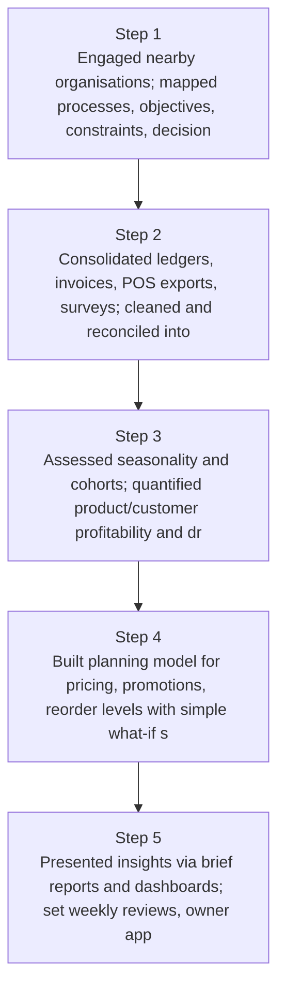
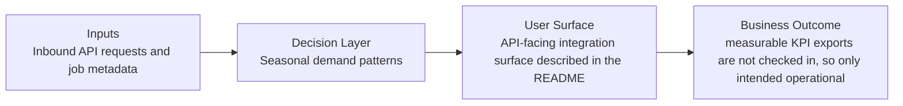
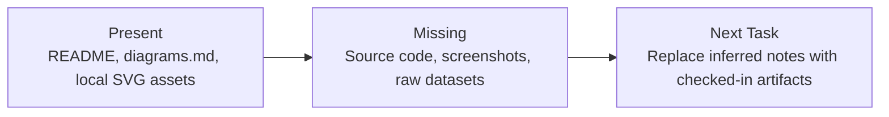

# Local Business Profit Planning Diagrams

Generated on 2026-04-26T04:29:37Z from README narrative plus project blueprint requirements.

## Profitability by product/customer

## Seasonal demand patterns

## Evidence Gap Map

